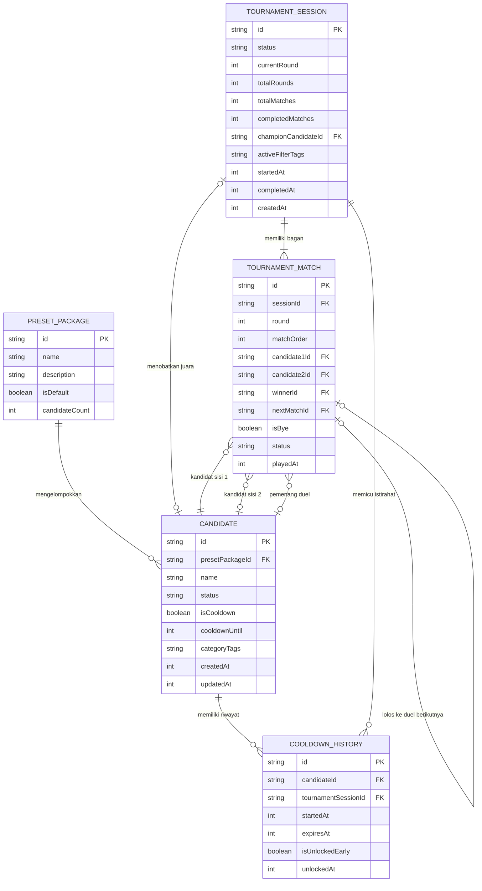

# System Specification: manow-v3-web (Pemecah Kebuntuan Makan Bersama)

- **Versi**: 1.0
- **Status**: Disetujui (Approved)
- **Tanggal**: 2026-09-04
- **Dokumen Induk**: [docs/PRD.md](PRD.md)
- **Decision Record**: [docs/decisions/SDR-202609040827.md](decisions/SDR-202609040827.md)

---

## 1. Traceability Matrix & Functional Scope

| ID Fitur PRD | Nama Fitur | ID User Story | Modul Sistem | Status Cakupan |
|:---|:---|:---|:---|:---|
| **F-01 (P0)** | Manajemen Shortlist Lokal & Paket Preset | `US-001` | Modul Shortlist & Storage | Lengkap |
| **F-02 (P0)** | Saringan Kilat Opsional 1-Ketukan | `US-002` | Modul Filter & Kurasi | Lengkap |
| **F-03 (P0)** | Generator Turnamen 1-lawan-1 & Bye Handling | `US-003` | Modul Tournament Engine | Lengkap |
| **F-04 (P0)** | Antarmuka Duel Kartu & Single-Step Undo | `US-004` | Modul Duel & UI Interaction | Lengkap |
| **F-05 (P0)** | Tampilan Juara & Web Share API | `US-005` | Modul Champion & Share | Lengkap |
| **F-06 (P0)** | Masa Istirahat Otomatis (Smart Cooldown Tag) | `US-006` | Modul Cooldown Engine | Lengkap |
| **F-07 (P0)** | Ketahanan Penyimpanan Lokal (Fail-Safe Storage) | `US-007` | Modul Storage Adapter | Lengkap |

---

## 2. Matriks Hak Akses Peran (Role-Based Access Control / RBAC Matrix)

### Deklarasi Cakupan Model Hak Akses (Zero-Login / Single-Tenant Client):
Sesuai PRD Seksi 3.1 dan keputusan PDR-202609040818, **manow-v3-web** beroperasi sebagai aplikasi peramban web statis murni (*pure client-side PWA*) tanpa backend server, tanpa database cloud, dan tanpa sistem login akun. 

Oleh karena itu, sistem otentikasi bertingkat (Admin vs User vs Guest) dan token sesi (JWT / OAuth2) secara resmi dinyatakan **N/A (Not Applicable / Tidak Diperlukan)** demi prinsip kesederhanaan (*anti-over-engineering / YAGNI*). Seluruh interaksi dijalankan di bawah satu model identitas tunggal: **Pengguna Perangkat Lokal (*Local Device Guest*)**.

| ID User Story / Aksi | Pengguna Lokal (Guest di 1 Ponsel) | Aturan Keamanan & Pembatasan Akses |
|:---|:---|:---|
| `US-001` (Kelola Shortlist & Preset) | Akses Penuh (CRUD Lokal) | Data tersimpan murni di `localStorage` peramban perangkat aktif. |
| `US-002` (Saring Kandidat) | Akses Penuh | Filter dieksekusi murni di memori RAM peramban tanpa panggilan jaringan. |
| `US-003` & `US-004` (Duel Turnamen) | Akses Penuh (Bergantian di 1 Layar) | Interaksi sentuhan dilindungi kunci sinkron (*ref lock*) dari sentuhan ganda. |
| `US-005` (Juara & Berbagi Hasil) | Akses Penuh | Menggunakan Web Share API / Clipboard API bawaan peramban tanpa server. |
| `US-006` (Buka Kunci Cooldown) | Akses Penuh (Manual Override) | Pengguna memiliki wewenang mutlak membuka kunci gembok kapan saja. |
| `US-007` (Pemulihan Storage) | Otomatis oleh Sistem | Validasi skema runtime; data korup otomatis dipulihkan ke preset bawaan. |

---

## 3. User Stories & Gherkin Acceptance Criteria

### US-001: Pengelolaan Shortlist & Preset Bawaan
- **Rujukan PRD**: F-01
- **Deskripsi**: Sebagai pengguna yang ingin memilih tempat makan bersama, saya ingin menyimpan tempat makan favorit dan memilih paket preset instan, sehingga saya tidak perlu mengetik ulang daftar makanan setiap kali lapar.
- **Prioritas**: P0 (MVP)

#### Acceptance Criteria (Gherkin):
```gherkin
Feature: US-001 Pengelolaan Shortlist dan Preset Bawaan

  Scenario: Happy Path - Inisialisasi otomatis paket preset pada pengguna baru
    Given aplikasi dibuka untuk pertama kali dan memori "localStorage" belum memiliki data shortlist
    When sistem memuat halaman utama
    Then sistem otomatis menginisialisasi shortlist dengan paket preset "Kuliner Kantor Hemat"
    And antarmuka menampilkan 5 opsi tempat makan aktif siap tanding
    And opsi pertama bernama "Warung Padang Sederhana" dengan tag "hemat"

  Scenario: Negative Path - Penolakan penambahan tempat makan dengan nama duplikat
    Given shortlist sudah memuat tempat makan bernama "Mie Ayam Jamur"
    When pengguna mencoba menambahkan tempat makan baru dengan nama "mie ayam jamur" (huruf kecil)
    Then sistem menolak penambahan data
    And menampilkan pesan peringatan "Nama tempat makan ini sudah ada di daftarmu"
    And jumlah total tempat makan di shortlist tidak bertambah

  Scenario: Edge Case - Penghapusan tempat makan dengan jaring pengaman notifikasi batal (Soft Delete with Undo Toast)
    Given terdapat tempat makan bernama "Bakso Solo Mas Pur" di shortlist
    When pengguna mengetuk tombol hapus pada "Bakso Solo Mas Pur"
    Then "Bakso Solo Mas Pur" langsung disembunyikan dari daftar shortlist
    And antarmuka menampilkan toast notifikasi "Warung dihapus" disertai tombol "Batalkan" selama 3.5 detik
    When pengguna mengetuk tombol "Batalkan" dalam waktu 2 detik
    Then "Bakso Solo Mas Pur" kembali muncul di daftar shortlist dengan urutan dan tag semula
```

---

### US-002: Saringan Kilat Opsional 1-Ketukan
- **Rujukan PRD**: F-02
- **Deskripsi**: Sebagai kelompok yang dibatasi situasi harian, saya ingin menyaring kandidat hanya dengan satu ketukan tombol kondisi, sehingga pertandingan hanya mempertemukan opsi yang cocok dengan bujet atau cuaca hari ini.
- **Prioritas**: P0 (MVP)

#### Acceptance Criteria (Gherkin):
```gherkin
Feature: US-002 Saringan Kilat Opsional 1-Ketukan

  Scenario: Happy Path - Menyaring kandidat dengan tag kondisi harian
    Given shortlist memuat 6 tempat makan:
      | name                    | tags            |
      | Warung Padang Garuda    | hemat, dekat    |
      | Ramen Bar San           | berkuah, pedas  |
      | Soto Lamongan Cak Min   | berkuah, hemat  |
      | Burger King Express     | dekat           |
      | Bakso Mercon            | berkuah, pedas  |
      | Nasi Uduk Kebon Kacang  | hemat           |
    When pengguna mengetuk tombol filter "Mau Berkuah"
    Then tombol "Mau Berkuah" bertanda aktif
    And kandidat yang lolos ke turnamen tersaring tepat menjadi 3 opsi
    And seluruh opsi yang tersaring memiliki tag "berkuah"

  Scenario: Negative Path - Saringan menghasilkan nol kandidat cocok (Smart Filter Fallback)
    Given shortlist hanya berisi tempat makan bertag "hemat" tanpa ada tag "berkuah"
    When pengguna mengetuk tombol filter "Mau Berkuah"
    Then sistem mendeteksi hasil saringan berjumlah 0
    And sistem menampilkan dialog ramah: "Belum ada warung yang cocok dengan saringan ini"
    And menyediakan tombol tindakan langsung "Matikan Saringan & Mainkan Semua"
    When pengguna mengetuk tombol tersebut
    Then seluruh saringan dinonaktifkan dan turnamen langsung siap dimulai

  Scenario: Edge Case - Menambahkan tag kustom baru hingga batas maksimal 5 tag per warung
    Given pengguna sedang mengedit tempat makan "Warung Padang Garuda" yang sudah memiliki 4 tag
    When pengguna menambahkan tag kustom baru "nongkrong"
    Then tag "nongkrong" berhasil ditambahkan (total 5 tag)
    When pengguna mencoba menambahkan tag keenam "malam"
    Then sistem menolak penambahan tag keenam dengan pesan "Maksimal 5 tag per tempat makan"
```

---

### US-003: Generator Turnamen 1-lawan-1 & Tiket Lolos Otomatis (Bye Handling)
- **Rujukan PRD**: F-03
- **Deskripsi**: Sebagai pasangan atau rekan kerja, saya ingin sistem menyusun bagan pertandingan 1-lawan-1 secara otomatis bahkan untuk jumlah pilihan ganjil tanpa batas, sehingga kami hanya membandingkan 2 opsi sekaligus tanpa pusing.
- **Prioritas**: P0 (MVP)

#### Acceptance Criteria (Gherkin):
```gherkin
Feature: US-003 Generator Turnamen 1-lawan-1 dan Bye Handling

  Scenario: Happy Path - Turnamen dengan jumlah peserta genap bebas
    Given pengguna memilih 6 kandidat aktif untuk bertanding
    When pengguna menekan tombol "Mulai Duel"
    Then sistem menyusun bagan pertandingan sistem gugur tunggal (Single Elimination)
    And total pertandingan yang harus diselesaikan tepat berjumlah 5 duel (6 - 1)
    And sistem menampilkan duel babak pertama antara kandidat 1 vs kandidat 2

  Scenario: Negative Path - Mencoba memulai turnamen dengan kandidat kurang dari dua
    Given hanya ada 1 tempat makan yang aktif dan tidak dalam masa istirahat
    When pengguna melihat layar awal
    Then tombol "Mulai Duel" berstatus nonaktif (disabled)
    And sistem menampilkan teks petunjuk "Pilih minimal 2 tempat makan untuk memulai duel"

  Scenario: Edge Case - Alokasi tiket lolos otomatis (Bye Handling) pada jumlah peserta ganjil
    Given pengguna memilih 5 kandidat aktif: "A", "B", "C", "D", "E"
    When pengguna menekan tombol "Mulai Duel"
    Then sistem menghitung kapasitas bagan kuadrat terdekat yaitu 8 (2^3)
    And sistem memberikan 3 tiket lolos otomatis (bye) ke babak berikutnya
    And ronde pertama hanya memainkan 1 pertandingan duel (5 - 4 = 1 duel)
    And 3 kandidat pemegang tiket bye otomatis melaju ke babak semifinal tanpa eror bagan
```

---

### US-004: Antarmuka Duel Kartu & Pembatalan Satu Langkah (Single-Step Undo)
- **Rujukan PRD**: F-04
- **Deskripsi**: Sebagai pemain yang memegang ponsel bersama teman, saya ingin memilih pemenang duel melalui kartu sentuh besar dan dapat membatalkan jika salah pencet, sehingga keputusan bisa diambil cepat tanpa takut salah tekan.
- **Prioritas**: P0 (MVP)

#### Acceptance Criteria (Gherkin):
```gherkin
Feature: US-004 Antarmuka Duel Kartu dan Single-Step Undo

  Scenario: Happy Path - Memilih kartu duel pemenang
    Given layar sedang menampilkan duel Ronde 1 antara "Warung Padang" dan "Mie Ayam"
    When pengguna mengetuk kartu "Warung Padang"
    Then kartu memberikan umpan balik visual aktif dalam tempo <100 milidetik
    And antarmuka mengunci sentuhan ganda selama 150 milidetik
    And duel ronde berikutnya langsung muncul di layar

  Scenario: Negative Path - Tombol batal tidak aktif saat belum ada riwayat pertandingan
    Given turnamen baru saja dimulai pada pertandingan pertama
    When pengguna melihat tombol "Batal / Undo"
    Then tombol "Batal / Undo" berada dalam kondisi nonaktif (disabled)
    And ketukan pada tombol tersebut tidak mengubah keadaan duel

  Scenario: Edge Case - Membatalkan satu keputusan duel terakhir (Single-Step Undo)
    Given pengguna baru saja memilih "Warung Padang" sebagai pemenang duel melawan "Mie Ayam"
    And layar sekarang menampilkan pertandingan duel berikutnya
    When pengguna menekan tombol "Batal / Undo"
    Then sistem mengembalikan layar duel ke pertandingan "Warung Padang" vs "Mie Ayam"
    And status kemenangan sebelumnya dibatalkan
    And tombol "Batal / Undo" kembali berstatus nonaktif hingga ada ketukan baru
```

---

### US-005: Tampilan Juara & Berbagi Hasil Tanpa Server
- **Rujukan PRD**: F-05
- **Deskripsi**: Sebagai kelompok yang telah menyelesaikan pertandingan, saya ingin melihat pengumuman juara mutlak dengan selebrasi visual dan membagikan hasilnya ke WhatsApp, sehingga keputusan langsung disepakati bersama dan teman lain terinformasi.
- **Prioritas**: P0 (MVP)

#### Acceptance Criteria (Gherkin):
```gherkin
Feature: US-005 Tampilan Juara dan Berbagi Hasil Tanpa Server

  Scenario: Happy Path - Pengumuman pemenang mutlak di babak final
    Given pertandingan babak final antara "Warung Padang" dan "Soto Kudus" sedang berlangsung
    When pengguna mengetuk kartu "Warung Padang"
    Then sistem menobatkan "Warung Padang" sebagai Juara Turnamen
    And memunculkan kartu juara di panggung selebrasi visual
    And tombol pembatalan (undo) dinonaktifkan secara permanen untuk mengakhiri perdebatan

  Scenario: Negative Path - Berbagi hasil pada peramban yang tidak mendukung Web Share API
    Given browser pengguna tidak memiliki API "navigator.share"
    When pengguna menekan tombol "Bagikan Hasil"
    Then sistem otomatis menyalin teks pengumuman juara ke papan klip (Clipboard API)
    And memunculkan toast "Teks juara berhasil disalin ke papan klip!"

  Scenario: Edge Case - Perlindungan ketukan beruntun pada tombol bagikan (Debounced Multi-Tap)
    Given pengguna berada di layar selebrasi juara
    When pengguna mengetuk tombol "Bagikan Hasil" sebanyak 3 kali dalam selang waktu 200 ms
    Then sistem hanya memicu 1 kali dialog share atau operasi clipboard
```

---

### US-006: Masa Istirahat Otomatis Menu Juara (Smart Cooldown)
- **Rujukan PRD**: F-06
- **Deskripsi**: Sebagai pengguna rutin, saya ingin menu yang baru menang otomatis diistirahatkan selama 24 jam namun tetap bisa dibuka kunci secara manual, sehingga menu kami bervariasi tanpa membatasi jika sedang ngidam.
- **Prioritas**: P0 (MVP)

#### Acceptance Criteria (Gherkin):
```gherkin
Feature: US-006 Masa Istirahat Otomatis Menu Juara (Smart Cooldown)

  Scenario: Happy Path - Menu juara otomatis masuk masa istirahat 24 jam
    Given "Warung Padang" baru saja memenangkan turnamen pada pukul 12:00 WIB
    When sistem kembali ke layar daftar shortlist
    Then "Warung Padang" memiliki status "isCooldown: true"
    And masa istirahat berlaku hingga pukul 12:00 WIB keesokan harinya (24 jam)
    And "Warung Padang" otomatis tidak diikutsertakan dalam turnamen berikutnya

  Scenario: Negative Path - Membuka aplikasi setelah masa 24 jam kadaluwarsa
    Given "Warung Padang" memiliki masa istirahat yang berakhir pada "2026-09-04T10:00:00Z"
    When aplikasi dibuka pada "2026-09-04T10:05:00Z"
    Then sistem mendeteksi waktu istirahat telah terlewati
    And status "isCooldown" otomatis dipulihkan menjadi "false" tanpa intervensi pengguna

  Scenario: Edge Case - Buka kunci manual tempat makan yang sedang istirahat (Manual Unlock)
    Given "Warung Padang" sedang dalam masa istirahat dengan ikon gembok terkunci
    When pengguna mengetuk ikon gembok tersebut
    Then status "isCooldown" langsung berubah menjadi "false"
    And "Warung Padang" langsung aktif kembali dan dapat dicentang untuk turnamen
```

---

### US-007: Ketahanan Penyimpanan Lokal (Fail-Safe Storage)
- **Rujukan PRD**: F-07
- **Deskripsi**: Sebagai pengguna peramban ponsel, saya ingin data saya tersimpan dengan aman dan aplikasi tidak pernah rusak jika memori ponsel penuh atau rusak, sehingga aplikasi selalu siap dipakai kapan saja.
- **Prioritas**: P0 (MVP)

#### Acceptance Criteria (Gherkin):
```gherkin
Feature: US-007 Ketahanan Penyimpanan Lokal (Fail-Safe Storage)

  Scenario: Happy Path - Pembacaan dan penulisan data lokal normal
    Given pengguna menambahkan tempat makan "Ayam Geprek Sambal Korek"
    When sistem menyimpan data ke kunci "manow_candidates"
    Then data tersimpan dalam bentuk string JSON yang valid
    And saat halaman dimuat ulang, data tersebut berhasil ditampilkan kembali

  Scenario: Negative Path - Pemulihan mandiri saat data JSON rusak (Corrupted Data)
    Given teks pada "manow_candidates" di localStorage berisi string korup "{invalid_json"
    When aplikasi dijalankan
    Then blok "try...catch" menangkap SyntaxError secara senyap
    And sistem tidak mengalami crash atau layar putih (zero crash)
    And sistem otomatis memulihkan data ke paket preset bawaan awal
    And menampilkan toast informasi ramah "Data diperbarui ke setelan awal"

  Scenario: Edge Case - Penanganan memori penuh (QuotaExceededError)
    Given memori peramban melempar kesalahan "QuotaExceededError" saat penyimpanan
    When sistem mencoba mengeksekusi fungsi simpan
    Then sistem menangkap galat tersebut dan beralih ke penyimpanan memori RAM sementara
    And alur turnamen saat itu tetap dapat berjalan lancar hingga penobatan juara
```

---

## 4. Core Domain Entities, ERD & Data Dictionary

### 4.1. Entity Relationship Diagram (ERD)



---

### 4.2. Kamus Data Domain Inti

#### 4.2.1. Entitas: `Candidate` (Kandidat Tempat Makan)
| Atribut / Field | Tipe Data | Wajib? | Unik? | Indeks? | Nilai Default | Keterangan & Batasan Validasi |
|:---|:---|:---|:---|:---|:---|:---|
| `id` | String (UUID v4) | Wajib | Ya | Ya (PK) | `crypto.randomUUID()` | Identitas unik entitas tempat makan. |
| `presetPackageId` | String \| null | Opsional | Tidak | Tidak | `null` | Relasi ke paket preset jika berasal dari bawaan. |
| `name` | String | Wajib | Ya | Ya (Lookup) | - | Nama tempat makan, 1–60 karakter, disanitasi teks murni. |
| `status` | Enum (`ACTIVE`, `COOLDOWN`, `IN_MATCH`, `ELIMINATED`, `CHAMPION`) | Wajib | Tidak | Tidak | `ACTIVE` | Status siklus hidup kandidat saat ini. |
| `isCooldown` | Boolean | Wajib | Tidak | Ya | `false` | Penanda cepat apakah sedang dalam masa istirahat pasca-juara. |
| `cooldownUntil` | Number \| null | Opsional | Tidak | Tidak | `null` | Timestamp milidetik masa istirahat berakhir (24 jam). |
| `categoryTags` | String[] | Wajib | Tidak | Tidak | `[]` | Maksimal 5 tag, tiap tag 1–20 huruf, lowercase. |
| `createdAt` | Number | Wajib | Tidak | Tidak | `Date.now()` | Timestamp milidetik pembuatan data. |
| `updatedAt` | Number | Wajib | Tidak | Tidak | `Date.now()` | Timestamp milidetik pembaruan data terakhir. |

#### 4.2.2. Entitas: `PresetPackage` (Paket Preset Bawaan)
| Atribut / Field | Tipe Data | Wajib? | Unik? | Indeks? | Nilai Default | Keterangan & Batasan Validasi |
|:---|:---|:---|:---|:---|:---|:---|
| `id` | String | Wajib | Ya | Ya (PK) | - | Kode unik paket preset (misal: `preset-kantor-hemat`). |
| `name` | String | Wajib | Tidak | Tidak | - | Nama paket yang tampil di UI (1–50 karakter). |
| `description` | String | Wajib | Tidak | Tidak | - | Deskripsi tema makanan dalam paket (1–150 karakter). |
| `isDefault` | Boolean | Wajib | Tidak | Tidak | `false` | Penanda paket utama yang dimuat saat storage kosong. |
| `candidateCount`| Number | Wajib | Tidak | Tidak | `5` | Jumlah tempat makan dalam paket ini. |

#### 4.2.3. Entitas: `TournamentSession` (Sesi Turnamen Aktif)
| Atribut / Field | Tipe Data | Wajib? | Unik? | Indeks? | Nilai Default | Keterangan & Batasan Validasi |
|:---|:---|:---|:---|:---|:---|:---|
| `id` | String (UUID v4) | Wajib | Ya | Ya (PK) | `crypto.randomUUID()` | Identitas unik sesi turnamen. |
| `status` | Enum (`DRAFT`, `RUNNING`, `PAUSED`, `COMPLETED`) | Wajib | Tidak | Tidak | `DRAFT` | Status alur turnamen saat ini. |
| `currentRound` | Number | Wajib | Tidak | Tidak | `1` | Babak ronde yang sedang berlangsung. |
| `totalRounds` | Number | Wajib | Tidak | Tidak | - | Total ronde turnamen ($\lceil\log_2 N\rceil$). |
| `totalMatches` | Number | Wajib | Tidak | Tidak | - | Total duel hingga juara ($N - 1$). |
| `completedMatches` | Number | Wajib | Tidak | Tidak | `0` | Jumlah duel yang sudah selesai ditentukan. |
| `championCandidateId` | String \| null | Opsional | Tidak | Tidak | `null` | ID kandidat pemenang final mutlak. |
| `activeFilterTags` | String[] | Wajib | Tidak | Tidak | `[]` | Daftar filter aktif yang dipilih saat mulai turnamen. |
| `startedAt` | Number \| null | Opsional | Tidak | Tidak | `null` | Timestamp milidetik saat duel pertama dimulai. |
| `completedAt` | Number \| null | Opsional | Tidak | Tidak | `null` | Timestamp milidetik saat juara final terpilih. |
| `createdAt` | Number | Wajib | Tidak | Tidak | `Date.now()` | Timestamp milidetik inisialisasi sesi. |

#### 4.2.4. Entitas: `TournamentMatch` (Pertandingan Duel 1-lawan-1)
| Atribut / Field | Tipe Data | Wajib? | Unik? | Indeks? | Nilai Default | Keterangan & Batasan Validasi |
|:---|:---|:---|:---|:---|:---|:---|
| `id` | String (UUID v4) | Wajib | Ya | Ya (PK) | `crypto.randomUUID()` | Identitas unik pertandingan duel. |
| `sessionId` | String (UUID v4) | Wajib | Tidak | Ya (FK) | - | Tautan ke ID sesi turnamen pemilik duel ini. |
| `round` | Number | Wajib | Tidak | Tidak | `1` | Nomor ronde duel ini berada. |
| `matchOrder` | Number | Wajib | Tidak | Tidak | `1` | Urutan pertandingan dalam ronde aktif. |
| `candidate1Id` | String \| null | Opsional | Tidak | Tidak | `null` | ID tempat makan sisi pertama duel. |
| `candidate2Id` | String \| null | Opsional | Tidak | Tidak | `null` | ID tempat makan sisi kedua duel (`null` jika tiket *bye*). |
| `winnerId` | String \| null | Opsional | Tidak | Tidak | `null` | ID tempat makan pemenang duel ini. |
| `nextMatchId` | String \| null | Opsional | Tidak | Tidak | `null` | ID duel babak berikutnya tempat pemenang melaju. |
| `isBye` | Boolean | Wajib | Tidak | Tidak | `false` | Penanda lolos gratis otomatis untuk peserta ganjil. |
| `status` | Enum (`PENDING`, `READY`, `COMPLETED`) | Wajib | Tidak | Tidak | `PENDING` | Kesiapan duel bertanding di layar. |
| `playedAt` | Number \| null | Opsional | Tidak | Tidak | `null` | Timestamp milidetik saat pengguna mengetuk pilihan. |

#### 4.2.5. Entitas: `CooldownHistory` (Riwayat Istirahat Menu)
| Atribut / Field | Tipe Data | Wajib? | Unik? | Indeks? | Nilai Default | Keterangan & Batasan Validasi |
|:---|:---|:---|:---|:---|:---|:---|
| `id` | String (UUID v4) | Wajib | Ya | Ya (PK) | `crypto.randomUUID()` | Identitas unik catatan riwayat istirahat. |
| `candidateId` | String (UUID v4) | Wajib | Tidak | Ya (FK) | - | ID tempat makan yang diistirahatkan. |
| `tournamentSessionId` | String (UUID v4) | Wajib | Tidak | Ya (FK) | - | ID turnamen yang dimenangkan. |
| `startedAt` | Number | Wajib | Tidak | Tidak | `Date.now()` | Timestamp milidetik mulai masa istirahat. |
| `expiresAt` | Number | Wajib | Tidak | Tidak | - | Timestamp milidetik berakhir (`startedAt + 24*3600*1000`). |
| `isUnlockedEarly` | Boolean | Wajib | Tidak | Tidak | `false` | Penanda jika dibuka kunci secara manual sebelum waktunya. |
| `unlockedAt` | Number \| null | Opsional | Tidak | Tidak | `null` | Timestamp milidetik saat gembok dibuka manual. |

---

### 4.3. Matriks Transisi Status Entitas (Finite State Machine / FSM)

#### 4.3.1. FSM Sesi Turnamen (`TournamentSession`)
Status Valid: `DRAFT`, `RUNNING`, `PAUSED`, `COMPLETED`.

| Status Awal | Aksi / Peristiwa Pemicu | Kondisi Penjaga (*Guard*) | Status Tujuan | Aksi Sistem (*Side Effect*) |
|:---|:---|:---|:---|:---|
| `DRAFT` | `START_TOURNAMENT` | Jumlah kandidat aktif tersaring $\ge 2$ | `RUNNING` | Bangun pohon duel (*bracket tree*), alokasikan tiket lolos otomatis (*bye*), catat `startedAt`. |
| `RUNNING` | `USER_PAUSE` | Pengguna meninggalkan layar / tab disembunyikan | `PAUSED` | Simpan progres sesi berjalan ke `localStorage`. |
| `PAUSED` | `USER_RESUME` | Pengguna membuka kembali aplikasi | `RUNNING` | Muat duel aktif terakhir yang belum selesai. |
| `RUNNING` | `SELECT_FINAL_WINNER` | Pertandingan final selesai (`completedMatches == totalMatches`) | `COMPLETED` | Set `championCandidateId`, catat `completedAt`, kunci tombol undo, picu selebrasi. |
| `RUNNING` | `ABORT_TOURNAMENT` | Pengguna menekan tombol batalkan / reset turnamen | `DRAFT` | Hapus bagan sementara, kembalikan status kandidat ke `ACTIVE`. |
| `PAUSED` | `ABORT_TOURNAMENT` | Pengguna mereset saat turnamen terjeda | `DRAFT` | Hapus sesi aktif, kembali ke layar shortlist awal. |
| `COMPLETED` | `START_NEW_SESSION` | Pengguna menekan tombol "Mulai Baru" di panggung juara | `DRAFT` | Daftarkan juara ke `CooldownHistory` (24 jam), inisialisasi sesi bersih baru. |

#### 4.3.2. FSM Kandidat (`Candidate`)
Status Valid: `ACTIVE`, `COOLDOWN`, `IN_MATCH`, `ELIMINATED`, `CHAMPION`.

| Status Awal | Aksi / Peristiwa Pemicu | Kondisi Penjaga (*Guard*) | Status Tujuan | Aksi Sistem (*Side Effect*) |
|:---|:---|:---|:---|:---|
| `ACTIVE` | `MATCH_SCHEDULED` | Kandidat dipasangkan ke duel yang sedang aktif di layar | `IN_MATCH` | Render kartu duel di antarmuka pengguna. |
| `IN_MATCH` | `WIN_ROUND` | Pengguna mengetuk kartu ini & ronde saat ini < final | `ACTIVE` | Loloskan kandidat ke slot duel ronde berikutnya (`nextMatchId`). |
| `IN_MATCH` | `LOSE_ROUND` | Pengguna mengetuk kartu lawan | `ELIMINATED` | Tandai gugur dari turnamen aktif saat ini. |
| `IN_MATCH` | `WIN_FINAL` | Pengguna memilih kartu ini pada duel babak final | `CHAMPION` | Tetapkan sebagai pemenang mutlak turnamen. |
| `CHAMPION` | `FINALIZE_SESSION` | Sesi turnamen ditutup menuju panggung juara | `COOLDOWN` | Pasang `isCooldown = true`, hitung `cooldownUntil = now + 24 jam`. |
| `COOLDOWN` | `TIME_EXPIRED` | Waktu saat ini $\ge$ `cooldownUntil` (24 jam tercapai) | `ACTIVE` | Set `isCooldown = false`, kosongkan timestamp rehat. |
| `COOLDOWN` | `MANUAL_UNLOCK` | Pengguna mengetuk ikon gembok di daftar shortlist | `ACTIVE` | Set `isUnlockedEarly = true`, izinkan ikut tanding kembali. |
| `ELIMINATED` | `SINGLE_UNDO` | Tombol urungkan duel diketuk untuk duel terakhir | `IN_MATCH` | Tarik kembali status gugur, tampilkan ulang kartu duel sebelumnya. |
| `ACTIVE` | `SINGLE_UNDO` | Tombol urungkan diketuk untuk pemenang non-final | `IN_MATCH` | Batalkan promosi ke ronde berikutnya, ulangi duel ronde tersebut. |

#### 4.3.3. FSM Pertandingan Duel (`TournamentMatch`)
Status Valid: `PENDING`, `READY`, `COMPLETED`.

| Status Awal | Aksi / Peristiwa Pemicu | Kondisi Penjaga (*Guard*) | Status Tujuan | Aksi Sistem (*Side Effect*) |
|:---|:---|:---|:---|:---|
| `PENDING` | `OPPONENTS_RESOLVED` | Kedua lawan (`candidate1Id` & `candidate2Id`) telah terisi | `READY` | Aktifkan kartu duel agar siap diketuk pengguna. |
| `PENDING` | `AUTO_BYE_TRIGGER` | `candidate2Id == null` dan `isBye == true` | `COMPLETED` | Otomatis tetapkan `winnerId = candidate1Id`, loloskan langsung ke `nextMatchId`. |
| `READY` | `PICK_WINNER` | Salah satu kartu tempat makan diketuk pengguna | `COMPLETED` | Catat `winnerId`, salin snapshot untuk undo, dorong ke `nextMatchId`. |
| `COMPLETED` | `UNDO_LAST_PICK` | Tombol pembatalan satu langkah (*undo*) diketuk | `READY` | Kosongkan `winnerId`, tarik kembali pemenang dari babak berikutnya. |

---

## 5. Kontrak Antarmuka Modul Lokal TypeScript

Seluruh komunikasi antar-modul di dalam peramban menggunakan pola amplop hasil seragam (*Discriminated Union Envelope*) untuk mengeliminasi kesalahan fatal (*runtime crash*).

```typescript
/**
 * Universal Result Envelope Standard
 * Format seragam untuk semua pengembalian fungsi modul lokal
 */
export type SuccessEnvelope<T> = {
  status: "success";
  data: T;
  meta?: {
    timestamp: number;
    [key: string]: unknown;
  };
};

export type ErrorEnvelope = {
  status: "error";
  error: {
    code: string;       // Kode terbaca mesin, misal: "ERR_DUPLICATE_NAME"
    message: string;    // Pesan ramah pengguna (ELI5)
    details?: unknown;  // Informasi tambahan untuk pelacakan debugging
  };
};

export type ResultEnvelope<T> = SuccessEnvelope<T> | ErrorEnvelope;

// ==========================================
// 1. Modul StorageRepository
// Pengelola penyimpanan lokal tangguh (Fail-Safe LocalStorage)
// ==========================================

export interface IStorageRepository {
  /**
   * Mengambil daftar seluruh kandidat tempat makan.
   * Otomatis memuat preset bawaan jika memori kosong atau format rusak (F-07).
   */
  getShortlist(): Promise<ResultEnvelope<Candidate[]>>;

  /**
   * Menambahkan kandidat baru dengan validasi anti-duplikasi nama (Q2: A).
   */
  addCandidate(payload: {
    name: string;
    tags: string[];
  }): Promise<ResultEnvelope<Candidate>>;

  /**
   * Mengubah informasi nama atau tag tempat makan yang sudah ada.
   */
  updateCandidate(
    id: string,
    patch: Partial<Pick<Candidate, "name" | "categoryTags">>
  ): Promise<ResultEnvelope<Candidate>>;

  /**
   * Menghapus tempat makan dengan mekanisme soft-delete & undo toast 3.5s (Q1: B).
   */
  deleteCandidate(id: string): Promise<ResultEnvelope<{ deletedId: string; undoToken: string }>>;

  /**
   * Membatalkan penghapusan tempat makan jika tombol undo toast ditekan.
   */
  undoDeleteCandidate(undoToken: string): Promise<ResultEnvelope<Candidate>>;

  /**
   * Memuat paket preset bawaan ke daftar shortlist.
   */
  applyPresetPackage(presetId: string): Promise<ResultEnvelope<Candidate[]>>;

  /**
   * Membuka kunci manual tempat makan yang sedang masa istirahat (cooldown override) (Q4: A).
   */
  unlockCooldown(candidateId: string): Promise<ResultEnvelope<Candidate>>;

  /**
   * Mengatur ulang seluruh data shortlist kembali ke paket preset bawaan.
   */
  resetToDefault(): Promise<ResultEnvelope<Candidate[]>>;
}

// ==========================================
// 2. Modul Tournament State Machine (Pure Reducer Engine)
// Mesin penyusun bagan turnamen sistem gugur fungsional, deterministik & adil
// Direalisasikan via Pure Reducer FSM (tournamentReducer) & useTournamentSession Hook
// ==========================================

export type TournamentAction =
  | { type: "START_TOURNAMENT"; payload: { candidates: Candidate[]; filterTags?: string[] } }
  | { type: "PICK_WINNER"; payload: { matchId: string; winnerId: string } }
  | { type: "UNDO_LAST_PICK" }
  | { type: "RESET_TOURNAMENT" };

export interface TournamentState {
  readonly session: TournamentSession | null;
  readonly activeMatch: TournamentMatch | null;
  readonly lastMatchSnapshot: TournamentMatch | null; // Single-step undo buffer O(1)
  readonly canUndo: boolean;
  readonly isLocked: boolean; // 150ms multi-tap mutex lock
}

export type TournamentReducer = (
  state: TournamentState,
  action: TournamentAction
) => ResultEnvelope<TournamentState>;

// ==========================================
// 3. Modul ShareService
// Jembatan berbagi hasil ke WhatsApp / Clipboard via API native peramban
// ==========================================

export interface IShareService {
  /**
   * Memeriksa apakah perangkat mendukung Web Share API native.
   */
  canShare(): boolean;

  /**
   * Membagikan teks pengumuman juara ke aplikasi perpesanan (WhatsApp/dll).
   * Otomatis beralih ke Clipboard API jika Web Share tidak didukung atau gagal (F-05).
   */
  shareChampionResult(payload: {
    championName: string;
    totalRounds: number;
  }): Promise<ResultEnvelope<{ method: "web-share" | "clipboard" }>>;
}
```

---

## 6. Validation Rules & Error Handling Matrices

| Kode Galat (*Error Code*) | Level HTTP / UI | Pemicu / Kondisi Kegagalan | Pesan Pengguna Ramah (ELI5) | Solusi & Strategi Mitigasi |
|:---|:---|:---|:---|:---|
| `ERR_EMPTY_NAME` | 422 / Input UI | Input nama tempat makan kosong atau hanya spasi | "Nama tempat makan tidak boleh kosong ya." | Arahkan kursor ke kolom input nama. |
| `ERR_DUPLICATE_NAME` | 409 / Conflict | Nama tempat makan sudah terdaftar di shortlist (case-insensitive) | "Tempat makan ini sudah ada di daftarmu." | Beri tanda merah pada kolom input nama. |
| `ERR_INSUFFICIENT_CANDIDATES`| 400 / Action UI | Memulai duel dengan kandidat aktif kurang dari 2 | "Pilih minimal 2 tempat makan untuk bertanding." | Nonaktifkan tombol mulai duel sampai $\ge 2$ opsi aktif. |
| `ERR_NO_FILTER_MATCH` | 404 / Filter UI | Kombinasi filter menghasilkan 0 tempat makan cocok | "Belum ada warung yang cocok dengan syarat ini." | Sediakan tombol 1-ketuk *"Matikan Saringan & Mainkan Semua"*. |
| `ERR_UNDO_NOT_AVAILABLE` | 400 / Action UI | Menekan tombol undo saat belum ada duel selesai atau saat di panggung juara | "Tidak ada duel yang dapat dibatalkan saat ini." | Nonaktifkan tombol undo secara visual di antarmuka. |
| `ERR_STORAGE_QUOTA_EXCEEDED` | 507 / Storage | Memori peramban penuh (`QuotaExceededError`) | "Penyimpanan ponsel penuh. Beralih ke memori sementara." | Beralih secara transparan ke in-memory session state. |
| `ERR_CORRUPT_STORAGE` | 500 / Storage | Data JSON di localStorage rusak (*SyntaxError*) | "Data dipulihkan kembali ke paket bawaan awal." | Bersihkan data korup dan muat preset default secara mulus. |
| `ERR_MAX_TAGS_EXCEEDED` | 422 / Input UI | Menambahkan lebih dari 5 tag pada satu tempat makan | "Maksimal 5 tag kategori untuk setiap tempat makan." | Kunci tombol tambah tag jika jumlah tag sudah mencapai 5. |

