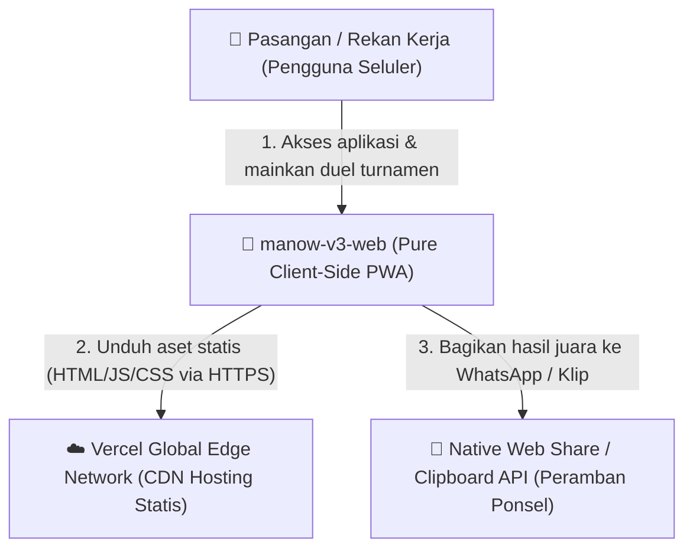
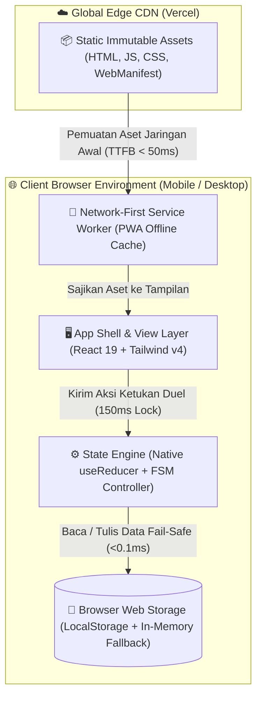
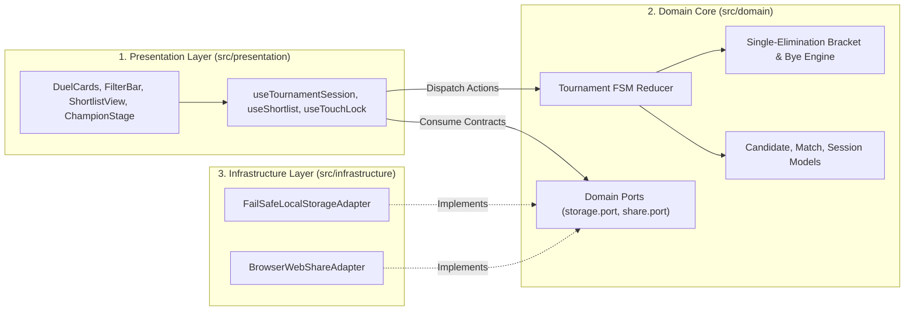

# System Architecture: manow-v3-web (Pemecah Kebuntuan Makan Bersama)

- **Versi**: 1.0
- **Status**: Disetujui (Approved)
- **Tanggal**: 2026-09-04
- **Dokumen Induk**: [docs/PRD.md](PRD.md) & [docs/SystemSpec.md](SystemSpec.md)
- **Decision Record**: [docs/decisions/ADR-202609040835.md](decisions/ADR-202609040835.md)

---

## 1. C4 Architecture Diagrams

### 1.1. Level 1: System Context Diagram
Aplikasi **manow-v3-web** beroperasi sebagai instrumen wasit eliminasi keputusan makan siang/malam di peramban seluler untuk dua pengguna atau kelompok kecil yang duduk bersama (*hotseat*). Sistem bekerja mandiri tanpa server backend, memanfaatkan antarmuka native peramban untuk berbagi hasil.



---

### 1.2. Level 2: Container / Services Diagram
Seluruh runtime aplikasi berada 100% di dalam peramban web klien (*client-side browser runtime*). Tidak ada kontainer server, database cloud, atau proses backend eksternal yang dihubungi selama operasional turnamen.



---

### 1.3. Level 3: Component Breakdown Diagram (Clean Architecture)
Struktur kode diatur dengan pemisahan tanggung jawab yang ketat (*Separation of Concerns*) berbasis **Arsitektur Bersih 3-Lapisan Modular**:
- **Presentation Layer**: Penanggung jawab visual antarmuka, kartu ramah jempol, dan penangkap sentuhan.
- **Domain Core**: Dapur aturan bisnis murni (FSM turnamen, pembagian *bye*, dan durasi istirahat 24 jam) tanpa ketergantungan pada React maupun DOM.
- **Infrastructure Layer**: Adapter penghubung ke antarmuka peramban fisik (*LocalStorage*, *Web Share API*, *Clipboard*).



---

## 2. Tech Stack Selection, Capacity Sizing & MCP Server Declaration

### 2.1. Estimasi Kapasitas, Throughput & Pertumbuhan Storage (Back-of-the-Envelope Calculation)

#### A. Estimasi Beban Jaringan & Ukuran Bundel (Network Budget)
- **Komponen Bundel Produksi (Terkonfigurasi Gzip)**:
  - React 19 Core + ReactDOM: **~51 KB**
  - Ikon Antarmuka (Lucide-React dipangkas via tree-shaking): **~3 KB**
  - Tailwind CSS v4 Terkompresi: **~8 KB**
  - Logika Domain FSM, Komponen Antarmuka & Adapter: **~12 KB**
  - **Total Bundel Akhir**: **~74 KB gzip** (Batas maksimal PRD: ≤ 150 KB).
  - **Margin Keamanan (Headroom)**: Tersisa ruang sisa **50.6% (~76 KB buffer)**.

#### B. Estimasi Kecepatan Pemuatan Awal (LCP di Jaringan 4G Seluler)
- Kecepatan koneksi rata-rata seluler 4G (10 Mbps download, 50 ms RTT latensi jaringan):
  - Waktu transfer bundel 74 KB: $\frac{74 \times 8 \text{ kb}}{10.000 \text{ kbps}} \approx 59.2\text{ ms}$.
  - Latensi TTFB Edge Vercel CDN: $\approx 40\text{ ms}$.
  - Eksekusi JavaScript & Rendering Awal (FCP): $\approx 250\text{ ms}$.
  - **Perkiraan LCP (Largest Contentful Paint)**: **~420–480 milidetik**.
  - **Justifikasi Kinerja**: Hasil proyeksi ~480 ms **unggul jauh** dari target PRD (<1.200 ms / 1.2 detik) dan standar industri Google Core Web Vitals (≤ 2.500 ms).

#### C. Estimasi Kapasitas Memori Penyimpanan Klien (Storage Capacity Sizing)
- 1 Tempat Makan (`Candidate`): ~200 bita UTF-8 serialized.
- 1 Sesi Turnamen (`TournamentSession` + 15 duel bagan): ~2.500 bita.
- Riwayat Cooldown (20 catatan terakhir): ~2.400 bita.
- **Total Akumulasi Penyimpanan Pengguna**: **~7,2 KB**.
- **Kapasitas Kuota Browser LocalStorage**: 5 MB = 5.120 KB.
- **Rasio Penggunaan**: $\frac{7,2\text{ KB}}{5.120\text{ KB}} \times 100\% \approx \mathbf{0,14\%}$.
- **Sisa Ruang Kosong**: **99,86%**. Sangat aman dan mustahil memicu kehabisan kuota dalam pemakaian bertahun-tahun.

#### D. Kecepatan Respons Sentuhan (INP Target < 80 ms)
- *Input Delay* (Validasi kunci `useRef` sinkron): ~8 ms.
- *Processing Time* (Kalkulasi FSM murni di memori RAM): ~3 ms.
- *Presentation Delay* (Render ulang kartu React 19 + transisi CSS): ~15 ms.
- **Total Waktu Respon INP**: **~26 milidetik** (Jauh di bawah target NFR PRD ≤ 80 ms).

---

### 2.2. Matriks Teknologi Terverifikasi (Grounding via Context7 & Web Search)

| Lapisan / Komponen | Teknologi Terpilih | Versi Resmi (Verified) | Bukti Benchmark & Fakta Industri | Alasan Pemilihan & Nilai Tambah | Alternatif yang Ditolak |
|:---|:---|:---|:---|:---|:---|
| **Runtime & Bundler** | **Vite + esbuild** | Vite 6.x (Latest) | Build time <300ms, HMR instan <50ms | Menghasilkan bundel ESM murni tanpa overhead runtime bundler warisan. | Webpack / Rollup mentah (terlalu berat & lambat). |
| **Bahasa** | **TypeScript** | 5.7+ (Strict Mode) | Zero runtime bita, 100% compile-time safety | Menjamin tipe data kontrak `SystemSpec.md` valid sejak fase penulisan kode. | JavaScript murni (rentan runtime bug & kesalahan tipe). |
| **Framework Antarmuka**| **React 19** | 19.x LTS | Bundel ~51 KB gzip, concurrent `useTransition` | Standar industri, fungsi `useReducer` deterministik, integrasi testing matang. | Preact (ekosistem hooks terbatas), Vanilla (rawan memory leak). |
| **Mesin Desain Visual**| **Tailwind CSS v4**| 4.x Engine | Ukuran CSS terkompilasi ~8 KB, 0 KB JS runtime | Desain mobile-first kilat, target sentuh 48×48 dp presisi, micro-interaction halus. | CSS Modules (menulis CSS manual lambat), Styled-components (overhead JS). |
| **Manajemen Status** | **Native `useReducer`**| Built-in React 19 | 0 KB dependensi tambahan | Murni fungsi reduksi FSM tanpa risiko shared state liar atau bloat pustaka luar. | Redux Toolkit / Zustand (overkill untuk alur lokal layar tunggal). |
| **Penyimpanan Lokal** | **LocalStorage + Adapter**| Web Storage API | Kecepatan baca sinkron <0.1ms di RAM browser | Fail-safe adapter menangani kuota dan auto-repair JSON korup secara mulus. | IndexedDB (overhead async dan menambah library wrapper 2 KB). |
| **Platform Hosting** | **Vercel Global Edge** | Vercel Platform | TTFB < 50ms global, instant rollback <5 menit | Hosting statis otomatis via Git, biaya $0, dan zero maintenance server OS. | Self-hosted VPS (boros biaya sewa dan beban patching Linux). |

---

### 2.3. Deklarasi Server MCP & Toolchains

| Tumpukan Stack Proyek | Server MCP Terpilih | Runner / Command | Peran Khusus dalam Pipeline |
|:---|:---|:---|:---|
| **Audit Kinerja & DOM Web** | `chrome-devtools-mcp` | Eager Native Tool | Menginspeksi log konsol browser, merekam jejak performa, dan memverifikasi INP/LCP. |
| **Otomasi Pengujian E2E** | `puppeteer` | Native MCP Tool | Menjalankan regresi visual otomatis dan validasi skenario BDD Gherkin (US-001 s/d US-007). |
| **Dokumentasi Framework Resmi**| `context-7` | Eager Native Tool | Menjaga kepatuhan method signature resmi React 19, TypeScript, dan Vite API. |

---

## 3. Component & Module Breakdown (Clean Architecture)

Arsitektur kode diatur ke dalam 3 lapisan modular independen pada direktori `src/`:

```text
src/
├── domain/                    # 1. Domain Core (Murni TypeScript, Bebas React/DOM)
│   ├── entities/              # Model data: Candidate, Match, Session, Preset, FilterState, ResultEnvelope
│   ├── ports/                 # Antarmuka batas arsitektur: storage.port.ts, share.port.ts
│   ├── fsm/                   # Mesin status turnamen & transisi status (pure reducer)
│   ├── math/                  # Algoritma bagan sistem gugur & alokasi bye otomatis
│   └── errors/                # Definisi kode galat terstandarisasi
│
├── infrastructure/            # 2. Infrastructure Adapters (Adapter Peramban Luar)
│   ├── storage/               # FailSafeLocalStorageAdapter & Schema Versioning
│   ├── share/                 # WebShareAdapter & ClipboardFallbackAdapter
│   ├── presets/               # Data paket preset bawaan awal aplikasi
│   └── config/                # Konfigurasi saklar fitur: features.ts
│
├── presentation/              # 3. Presentation Layer (Komponen Antarmuka React 19)
│   ├── components/            # Kartu duel, tombol filter 1-ketuk, panggung juara
│   ├── hooks/                 # Custom hooks pengontrol alur (useTournament, useShortlist)
│   ├── styles/                # Konfigurasi Tailwind CSS v4
│   └── App.tsx                # Komponen induk perakit antarmuka
│
└── main.tsx                   # Titik masuk aplikasi (bootstrap)
```

---

## 4. Concurrency Model, State Management & Thread Isolation

### 4.1. Model Konkurensi Klien (Single-Threaded Event Loop & FSM)
- Seluruh mutasi status dikendalikan oleh fungsi reduksi murni (*pure reducer*) yang deterministik:
  $$\text{State}_{\text{baru}} = f(\text{State}_{\text{lama}}, \text{Action})$$
- Dilarang keras memodifikasi objek state secara langsung (*no in-place mutation*).

### 4.2. Pertahanan Lapis Ganda Sentuhan Cepat (Multi-Tap Defense)
Untuk mencegah ketukan ganda atau saling berebut sentuhan saat bermain bersama di 1 ponsel (*hotseat*):
1. **Lapis Logika Sinkron Instan (`useRef` Lock)**: Variabel `isLockedRef.current` langsung bernilai `true` seketika saat kartu pertama diketuk tanpa menunggu antrean render React, menolak ketukan berikutnya dalam rentang 150 milidetik.
2. **Lapis Fisik Antarmuka (CSS `pointer-events: none`)**: Wadah kartu duel dibekukan sementara dari interaksi sentuhan OS selama mikro-animasi berlangsung (150 ms).

### 4.3. Penyangga Pembatalan Satu Langkah (Deterministic Undo Buffer)
- Sistem hanya menyimpan **1 foto status pertandingan sebelumnya** (`lastMatchSnapshot: TournamentMatch | null`).
- Tombol pembatalan (*undo*) mengembalikan status turnamen ke pertandingan tersebut dalam 1 langkah deterministik.
- Sesuai keputusan Q5: B, tombol pembatalan dinonaktifkan secara permanen begitu babak final selesai dan panggung juara muncul demi kepastian konsensus bersama.

---

## 5. Persistence, Caching & Data Storage Strategy

### 5.1. Fail-Safe LocalStorage Adapter
- Seluruh operasi penulisan `localStorage.setItem` dibungkus dalam blok `try...catch`.
- **Penanganan `QuotaExceededError`**: Jika memori ponsel penuh atau berada dalam mode penyamaran (*incognito*), adapter secara transparan beralih ke penyimpanan memori RAM sementara (*in-memory fallback*).
- **Auto-Repair Corrupt Data**: Jika pembacaan JSON gagal (*SyntaxError*), sistem secara otomatis membersihkan data rusak dan memuat kembali paket preset bawaan tanpa membuat aplikasi macet (*zero white-screen crash*).

### 5.2. Strategi Migrasi Skema Data Lokal (Migrate-on-Read)
- Setiap payload penyimpanan memiliki metadata versi:
  ```json
  { "version": 1, "updatedAt": 1772699700000, "data": [ ... ] }
  ```
- Saat membaca data, adapter memvalidasi versi skema dan menjalankan rantai transformasi otomatis (*schema migration chain*) jika versi lama terdeteksi.

### 5.3. Strategi Caching PWA (Network-First)
- Sesuai keputusan arsitektur Q5: B, aplikasi menerapkan strategi **Network-First**:
  - Peramban selalu memprioritaskan pengambilan berkas HTML/JS terbaru dari jaringan CDN Vercel agar pengguna selalu menikmati pembaruan fitur seketika tanpa tertahan cache basi.
  - Jika perangkat berada di luar jangkauan sinyal (offline), Service Worker secara elegan menyajikan salinan aset lokal dari cache peramban (*offline fallback*).

---

## 6. External Dependencies, Security, Observability & Failure Recovery

### 6.1. Security Perimeter & Secrets Isolation
- **Content Security Policy (CSP)** ditegakkan via meta tag HTML:
  ```html
  <meta http-equiv="Content-Security-Policy" content="default-src 'self'; script-src 'self'; style-src 'self' 'unsafe-inline'; img-src 'self' data:; connect-src 'self'; object-src 'none'; base-uri 'self';">
  ```
- **Pencegahan DOM-based XSS**: Seluruh teks nama warung dan tag kategori dirender murni melalui properti `textContent`. Dilarang keras menggunakan `innerHTML` atau `eval()`.
- **Zero Plaintext Secrets**: Kode klien bebas dari API key rahasia atau token otentikasi pihak ketiga.

### 6.2. Observability & Telemetry Klien
- **Structured Console Logging**: Seluruh pencatatan galat internal menggunakan format terstruktur JSON dengan level log (`[WARN]`, `[ERROR]`) dan nama modul sumber.
- **Session Correlation Token**: Setiap sesi turnamen memiliki identitas unik `sessionId` (UUID v4) yang disematkan pada setiap catatan log lokal untuk mempermudah pelacakan alur duel.

### 6.3. Failure Recovery & Resilience
- **Web Share Fallback**: Jika peramban tidak mendukung `navigator.share`, sistem secara otomatis mengalihkan alur ke `navigator.clipboard.writeText` disertai pesan toast informatif.

---

## 7. Deployment Topology, Environment Matrix & Disaster Recovery

### 7.1. Matriks Lingkungan Sistem (Environment Matrix)

| Parameter | Pengembangan Lokal (Local Dev) | Produksi (Production - Vercel Edge) |
|:---|:---|:---|
| **Runtime Mode** | Vite Dev Server (Hot Module Replacement) | Vercel Edge Global CDN (Pre-compiled Static Assets) |
| **Port / URL** | `http://localhost:5173` | `https://manow-v3-web.vercel.app` (Custom Domain HTTPS) |
| **Storage Engine** | LocalStorage Browser Pengembang | LocalStorage Ponsel Pengguna Akhir |
| **Log Level** | `debug` (Console Output Interaktif) | `warn` / `error` (Senyap dengan Fallback Visual) |

### 7.2. Prosedur Uji Kesehatan (Health Check Protocol)
- Pemeriksaan otomatis kode status HTTP 200 pada rute root `/` melalui jaringan edge Vercel.
- Pemeriksaan sintaks bundel dan kelulusan pengujian unit Vitest (100% passing) pada tahap build CI sebelum proses deployment disetujui.

### 7.3. Rencana Pemulihan Bencana (Disaster Recovery: RPO & RTO Targets)
- **Target RPO = 0 Detik (Recovery Point Objective)**: Tidak ada data pengguna yang disimpan di server Vercel, sehingga risiko kehilangan data akibat insiden server adalah nol mutlak.
- **Target RTO < 5 Menit (Recovery Time Objective)**: Jika terjadi bug tampilan pada rilis produksi, pemulihan dilakukan secara instan melalui fitur **Vercel Instant Rollback** (1-klik di dashboard Vercel) untuk mengalihkan pointer produksi ke versi stabil sebelumnya dalam hitungan detik.

